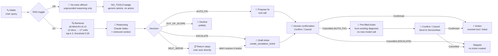

# TriagePilot — L1 IT Support Agent

### Problem

Most L1 tickets aren't hard — they're just troubleshooting simple, repetitive tasks. For an office worker, though, it doesn't feel small — work stops until someone shows up to fix it.

- **The work is repetitive, not complex.** Routine issues (software installs, OS config, workplace setup) sit in a queue until a technician is free, identifies the pattern, looks up the procedure, and acts. The fix is rarely novel — the dispatch delay is the struggle.
- **In Swiss SMEs, dispatch means travel.** A single technician often supports multiple client locations, since a small office can't justify a full-time on-site IT presence. Travel time to and from site is frequently a larger cost than the fix itself.
- **Skilled IT hours are expensive and scarce in this region.** Time spent traveling and pattern-matching a known issue is time not spent on the complex work only that technician can do.

**TriagePilot targets exactly that slice: high-frequency, well-documented, low-novelty tickets — resolved remotely, before a trip is even needed.**

### Stakeholder Profiles Breakdown

| Stakeholder | Job-to-be-Done | Pain | Gain — Basic | Gain — Surprising | Key metric |
|---|---|---|---|---|---|
| **Employees** | Get back to work with minimal disruption | Long wait for trivial issues; repeating context to technicians | Faster resolution for well-documented issues | Explainable, grounded self-serve guides for basic IT issues; generating a service ticket based on their issue automatically | Mostly qualitative, but IT issues influence productivity|
| **L1 Technicians** (on-site dispatch, multi-client) | Triage & resolve routine tickets, escalate the rest with context | Repetitive pattern-matching across multiple unfamiliar client environments; unclear user requests | Fewer routine tickets to resolve manually or dispatch for | AUTO_FIX shifts burden from diagnosis to confirmation; escalation write-ups auto-generated | Time-to-first-action|
| **L2/L3 Specialists** (remote, outsourced offshore)| Resolve complex issues without re-diagnosing from scratch; keep documentation up-to-date | Escalations under-documented; no live L1 to call back and clarify across timezones; quality varies by which L1 technician handled it | Escalations arrive with diagnostic summary + retrieval trace | Consistent documentation regardless of which technician escalated | Mean-time-to-resolution |
| **CTO** (of the IT service provider) | Keep cost-per-ticket low, maintain SLA & audit compliance; price and justify contracts | Cost-per-ticket opaque; no per-category automation visibility; audit risk on unlogged fixes | Lower cost-per-ticket; automation-rate reporting by client account | Automation-rate data becomes a pricing/contract lever — accounts with low automation potential (highly custom environments) can be identified and priced or staffed differently  | Cost-per-ticket by category; SLA compliance rate |

### Economic potential:

**Assumption:** ~4 tickets/day/technician, ~2 h avg per ticket including travel to and from client site.

| Automation rate | Time recovered/day | Value/technician/year |
|---|---|---|
| 30% (conservative) | ~2.4 h | ~CHF 32k |
| 50% (target) | ~4.0 h | ~CHF 53k |
| 70% (optimistic) | ~5.6 h | ~CHF 74k |

*(CHF 60/h fully-loaded technician cost, 220 working days/year, 2h/ticket including travel, 4 tickets/day.)*

For SME customers specifically, remote resolution via SELF_SERVE/AUTO_FIX removes the travel leg entirely for automatable tickets — this is not just faster resolution, it's a dispatch trip that never has to happen. Not netted against this figure: knowledge-base curation/maintenance effort, LLM inference cost per ticket, and technician review overhead during AUTO_FIX confirmation.

### Data potential
Every triage run appends a row to `logs.csv` — query, retrieved units, decision path, diagnostic summary, tool called, operator confirmation, escalation queue/priority, response time — and the app's "Live session stats" panel turns that into a running summary (path distribution, automation rate, avg response time) shown alongside the golden-set eval (see [Evaluation](#evaluation)). Over time, the same log supports:
- Retrieval threshold tuning, per category
- Cost-per-resolution-path analysis (AUTO_FIX cost vs. ESCALATE technician-hour cost)
- A natural link to quantitative/pricing-style analysis of automation vs. human dispatch

---

## Architecture



| Path | When | Operator action required? |
|---|---|---|
| **SELF_SERVE** | Fix is documented, safe, and user-executable | No — steps returned directly; "didn't resolve it" button escalates (see below) |
| **AUTO_FIX** | Fix is documented, reversible, better run by the agent | Yes — Confirm runs the tool; Cancel pre-fills an escalation ticket instead of just dropping the issue (see below) |
| **ESCALATE** | Info missing, infra-/hardware-/IAM-side issue, or low confidence | Yes — Confirm or Cancel before ticket is created |
| **OUT_OF_SCOPE** | Not a workplace-technology request at all | No — declined immediately |

**Scope check:** OUT_OF_SCOPE is reserved for requests unrelated to workplace technology (weather, personal advice, general knowledge, creative tasks). An IT-related request that needs identity/access-management, security-team, or admin-level action beyond user self-service — adding someone to a security group, granting elevated permissions, a suspected account compromise — is not out of scope. It's real IT work that exceeds desktop-support scope, so it routes to ESCALATE, not OUT_OF_SCOPE.

**SELF_SERVE fallback:** if the returned steps don't fix it, a button on the result ("This didn't resolve it — escalate to a technician") converts the result in place into the same ESCALATE ticket-preview/Confirm/Cancel flow — reusing `create_escalation_ticket` rather than adding a new tool. The generated summary explicitly notes self-serve was already attempted, so the receiving technician doesn't repeat those steps; queue defaults to `DESKTOP-SUPPORT`, priority `P3-Normal`.

**AUTO_FIX decline:** declining a proposed fix doesn't end the flow either. The app pre-fills an escalation ticket client-side from the diagnosis already produced in that response — no second model call — carrying the declined tool's name, a fixed reason ("User declined proposed automated fix; issue persists"), the existing diagnostic summary, and a `P3-Normal` default priority. That ticket gets its own, separate Confirm ("Send to ServiceNow") / Cancel step before `create_escalation_ticket` actually runs. Accepting AUTO_FIX and declining it both end up at the same human-confirmation pattern — they diverge only in what's being confirmed, not in whether confirmation is required.

**RAG off:** none of the four paths above apply. The agent is given no tools at all for that call, so it cannot classify or act — it just returns hedged, ungrounded text, and the UI shows a distinct `NO TOOLS (RAG OFF)` badge instead of a path badge.

---

## How it works

**Stack:** Claude API (generation + tool-use), `sentence-transformers` with `all-MiniLM-L6-v2` (local embeddings — no API cost per query), Streamlit (frontend + session state for HITL confirmation).

**Knowledge base:** 12 Markdown files. 11 are single-issue playbooks, each embedded whole as one retrieval unit. The 12th, `company-profile.md`, is a multi-topic org reference (systems, escalation queues, policies) — it's split into one unit per `##` section instead, so a query can match its one relevant section directly rather than the whole mixed-topic file. 17 retrievable units total. `retrieve()` returns up to the top 2 units (cosine similarity, threshold 0.35 per unit) ranked together regardless of source doc — this is what lets one query pull both an issue playbook and a policy section in the same call. Within each matched unit, individual lines are re-scored against the same query embedding for sentence-level highlighting (threshold 0.25) — same model, no extra inference cost, no additional dependencies.

**Decision flow:** single-shot (one LLM call per query). The model receives the query + up to 2 retrieved KB units — possibly from different source documents — and must classify immediately into SELF_SERVE / AUTO_FIX / ESCALATE / OUT_OF_SCOPE, synthesizing across all retrieved units, and call the appropriate tool. No multi-turn — missing information forces an explicit ESCALATE with reasoning rather than a clarifying question. When RAG is off, no tools are offered at all (not just no retrieval) — the agent can only respond in plain, ungrounded text; see the RAG on/off toggle below.

**Tool execution:** the agent returns a structured tool call (name + parameters). The app shows the proposed action to the operator before anything runs. On Confirm, the tool is dispatched. On Cancel, behavior depends on the path: for ESCALATE, nothing changes and no ticket is created; for AUTO_FIX, declining pre-fills an escalation ticket from the diagnosis already in that response (no new model call) and asks for a separate confirmation before it's sent. Every terminal state is logged with a timestamp.

---

## Why a knowledge base matters

A dispatch technician supporting multiple SME clients can't hold each client's environment in their head — Limmatica's AD group names aren't the same as the next client's, and policies get updated independently of any single technician's memory. Without retrieval, the model faces the same problem: it can only give generic advice — it has no way to know Limmatica's internal portal addresses, script paths, AD group names, or policy codes. The KB articles contain details that no pre-trained model, and no technician juggling several clients, could reliably carry:

- `vpn-gp.limmatica.corp` — the GlobalProtect gateway address post-migration
- `\\IT-TOOLS\Scripts\reset-vpn-profile.ps1` — the exact remediation script
- `Finance-RW` — the AD group that governs shared-drive access for Finance users
- `SEC-04` — the internal policy requiring escalation after 2+ lockouts in 24 h
- Q1 2026 AnyConnect → GlobalProtect migration context

This is where RAG's value is structural, not incidental: each client's KB lives and updates independently in its own retrieval source, so a technician (or the agent acting on their behalf) always pulls the *current* policy and config for *that* client at query time — without needing to have memorized it, and without risking a stale or cross-client mix-up.

**RAG on/off toggle**: Without RAG, an LLM falls back to generic, hedged advice with no specific references to client company's IT environment.

---

## Where this could run

| Integration point | How | ServiceNow field mapping |
|---|---|---|
| ServiceNow intake | REST API POST to `/api/now/table/incident` | `app.queue` → `assignment_group` |
| Ticket ID | Auto-generated `INC{random}` (simulated) | `app.ticket_id` → `number` |
| Caller | `current.user` resolved via Okta | `app.requested_by` → `caller_id` |
| Priority | `P3-Normal` / `P2-High` / `P1-Critical` | `app.priority` → `priority` (3/2/1) |
| Short description | One-sentence diagnostic from LLM | `app.summary` → `short_description` |
| Category | IT Support / Endpoint | hardcoded → `category` |

The tool schema (`create_escalation_ticket`) is already structured to map 1-to-1 onto a ServiceNow incident record. Wiring it to a real instance is a configuration change, not a redesign.

---

## Demo queries

| Query | Expected path | What it demonstrates |
|---|---|---|
| "My VPN keeps disconnecting" | AUTO_FIX (usually) → `reset_vpn_profile`* | RAG on: cites migration, SCEP cert, exact script path. RAG off: generic advice, no tools, `NO TOOLS` badge. |
| "Teams shows me as offline to everyone" | AUTO_FIX → `clear_teams_cache` | Retrieved doc determines triage order (checks build version first). |
| "Floor 5 print queue is stuck" | AUTO_FIX → `restart_print_spooler` | Floor-wide scope triggers server-side fix, not single-user troubleshooting. |
| "VPN cert error, gateway confirmed correct, offline for a month" | AUTO_FIX → `reset_vpn_profile` | Precise query context (confirmed gateway + offline duration) routes directly to cert reset. |
| "Need Zoom installed, no admin rights, it's in Company Portal" | AUTO_FIX → `push_approved_software` | Intune push path instead of directing user to portal UI. |
| "I'm locked out of my account" | ESCALATE → `SEC-INCIDENT` | Lockout frequency absent; per SEC-04 that distinction changes the path entirely. |
| "Locked out twice already today" | ESCALATE → `SEC-INCIDENT` (P2) | Cross-document retrieval: pulls the `account-access` playbook *and* the SEC-04 §4.2 section from `company-profile.md` in the same call — the policy section, not the playbook, is what forces escalation over a routine unlock. |
| "My OneDrive has been stuck syncing for two days" | ESCALATE → `M365-SYNC` | Ambiguous without quota/filename/department info — escalates with explicit reasoning. |
| "My external monitor isn't detected when docked" | SELF_SERVE or ESCALATE | KB has detailed self-serve steps (reseat cable, firmware, input source). May escalate to HW-REPLACE if the doc's steps are exhausted. |
| "What's the weather like today?" | OUT_OF_SCOPE | Scope-check fires before any diagnosis; no retrieval, no tool call. |

\* This bare query is genuinely underspecified — KB-0142 (`vpn.md`) documents three distinct causes, only one of which is safe to auto-fix, so single-shot classification can legitimately land on SELF_SERVE, AUTO_FIX, or ESCALATE from run to run. The more detailed query further down this table (with gateway + offline duration stated) resolves this ambiguity and consistently hits AUTO_FIX. Measured in `eval.py` — see [Evaluation](#evaluation).

### Manual test: declining an AUTO_FIX

Run "My VPN cert error persists, I've confirmed the gateway is correct and I was offline for a month" (routes to AUTO_FIX → `reset_vpn_profile`), then click **Cancel** instead of Confirm. The app shows "Automated fix declined — here's a pre-filled ticket," built entirely from the diagnosis already displayed in section 3 above — no second model call. The draft ticket carries the declined tool name (`reset_vpn_profile`), the fixed reason "User declined proposed automated fix; issue persists," the original diagnostic summary, queue `DESKTOP-SUPPORT`, and priority `P3-Normal`. Clicking "Send to ServiceNow" dispatches `create_escalation_ticket` exactly as the ESCALATE path does; clicking Cancel again dismisses it with no ticket created and no fix applied. This is a UI/state-flow behavior, not a retrieval or path-classification outcome, so it isn't part of `eval.py`'s golden set — verify it manually with the steps above.

---

## Evaluation

The app surfaces two independent measurements side by side, each in its own expander, clearly labeled — neither stands in for the other.

**Golden-set evaluation** (`eval.py`) runs a hand-labeled set of 10 queries — the same ones in the table above — directly against `retrieve()` and `run_triage()`, no UI involved. **This is a labeled set of 10 we wrote ourselves, not an external or third-party benchmark** — treat the numbers as a regression check on this specific KB and prompt, not a generalizable retrieval-quality claim. Run it yourself: `python eval.py`.

| Metric | Result | What it measures |
|---|---|---|
| Retrieval accuracy (top-1) | 100% | The single best-ranked unit is a correct match for the query |
| Path accuracy | 90–100%\* | Fraction of queries classified into the stated expected path |

Only these two metrics are reported. Precision/recall-style set-overlap metrics don't fit this retrieval design: because top-k=2 deliberately pulls from more than one source when relevant (an issue playbook plus a company-profile.md section, or two playbooks together), a correctly grounded answer can legitimately come back with a second, tangentially related unit alongside the strictly-required one — a set-overlap metric scores that as a false positive even though nothing is actually wrong, so top-1 retrieval accuracy is the metric that reflects retrieval quality here.

\* Path accuracy varies run to run (observed 90% and 100% across repeated runs) — it is not retrieval that's unstable (retrieval is deterministic given fixed embeddings and scores 100% consistently above), it's LLM sampling on the one genuinely underspecified query in the set (see the VPN row footnote above). This is exactly the kind of case single-shot classification handles by escalating with stated reasoning rather than guessing — which is arguably still a "correct" outcome the golden set's single expected-path label doesn't fully capture.

**Live session stats** (`analyze_logs.py`, reading `logs.csv`) is a different measurement: real usage, not a fixed test set. `logs.csv` starts empty, and one row is appended after every query actually run through the app — timestamp, query, retrieved units, decision path, diagnostic summary, tool called, operator confirmation (AUTO_FIX rows only), escalation queue/priority (ESCALATE rows only), and measured response time. The app's "Live session stats" expander reads this file fresh on every render — never cached, unlike the golden-set numbers above — and reports total logged queries, count and % by decision path, automation rate (SELF_SERVE + AUTO_FIX over total minus OUT_OF_SCOPE), and average response time by path, labeled explicitly as **"Agent response time (proxy for MTTR — measures decision latency, not full ticket resolution)"** since it only times the model call that produces a decision, not how long a human then takes to act on it. Below five logged queries, the panel says the sample is too small for a stable rate rather than presenting a percentage as reliable. Run it standalone: `python analyze_logs.py`.

---

<details>
<summary><strong>RAG design decisions</strong></summary>

- **One file per KB article, except reference docs** — the 11 issue playbooks are each one retrieval unit (whole file, no chunking overhead, no boundary ambiguity). `company-profile.md` is different: it's a multi-topic org reference (systems, escalation queues, policies, quirks), not a single-issue article, so treating it as one unit would dilute its embedding across unrelated topics and bury the one section actually relevant to a query. It's chunked by `##` heading instead — one retrievable unit per section — so e.g. its "Governing policies" section can rank on its own merits.
- **Why company-profile.md needed this specifically:** it's the one doc every other KB article assumes as background (policy numbers, queue ownership, naming conventions) rather than a resolvable issue in itself. Embedded whole, a query like a lockout question would match it only weakly overall even though one paragraph (SEC-04) is exactly what determines the path — chunking surfaces that paragraph directly instead of relying on the model to find it inside a large, mixed-topic block.
- **Top-k=2, ranked across all units regardless of source doc** — `retrieve()` returns up to 2 units above the 0.35 threshold from one flat index spanning atomic docs and reference sections alike. This is what enables cross-document grounding: a query can pull one issue-playbook unit and one policy-section unit in the same call, and the agent is prompted to synthesize both rather than assume single-source grounding.
- **Threshold 0.35** — without it, retrieval always returns something, even for queries with no KB match, and the model may hallucinate grounding. The threshold makes the "no confident match" case explicit; it applies per-unit, so top-k can return 0, 1, or 2 units.
- **Sentence-level highlights** — same `all-MiniLM-L6-v2` model scores individual sentences against the query, threshold 0.25 (looser than the 0.35 unit-level threshold, since a highlight is illustrative, not a retrieval gate). Shows the reviewer exactly which lines triggered the retrieval decision. No additional dependencies.
- **Single-shot classification** — multi-turn dialogue adds latency, requires session state, and obscures the classification logic. Single-turn forces the agent to be explicit about missing information, which produces better escalation summaries than open-ended exchanges.
- **Human-in-the-loop on both AUTO_FIX and ESCALATE** — AUTO_FIX is obvious (don't silently unlock accounts). ESCALATE also gets a gate because opening a ticket routes to an on-call queue, starts an SLA clock, and notifies a technician. Both are consequential.

</details>

<details>
<summary><strong>Extending with MCP</strong></summary>

The tools here are called via Anthropic's native tool-use API (`tools=` in `messages.create`). MCP (Model Context Protocol) is the natural next step:

- **Service discovery** — agent discovers available tools (AD, Intune, ServiceNow connectors) at runtime via the MCP server manifest, without hardcoding schemas in the agent.
- **Credential isolation** — each connector runs in its own MCP server with scoped service-account credentials, keeping secrets out of the agent process.
- **Reuse across agents** — the same MCP connector for ServiceNow can be shared by this triage agent, a change-management agent, and an on-call bot without duplicating integration code.
- **Live KB sync** — an MCP resource server can expose the KB article directory, letting the agent pull the latest doc content at query time rather than from a static embedded index.

</details>

<details>
<summary><strong>Evaluation metrics for production RAG</strong></summary>

- **MTTR per path** — the primary business metric. Baseline against queue-mediated L1 (4–8 h target). Track separately for SELF_SERVE, AUTO_FIX, and ESCALATE so regressions are path-specific.
- **Retrieval accuracy@1** — fraction of queries where the top-ranked KB article is the correct one. Baseline requires a labelled query→article mapping.
- **Path accuracy** — fraction of queries classified into the correct path. Requires a held-out test set with ground-truth labels.
- **Escalation accuracy** — fraction of escalated tickets that the receiving technician confirms were correctly escalated.
- **Tool parameter validity** — fraction of AUTO_FIX calls with only concrete parameter values (no unresolved `current.user` in production).
- **False AUTO_FIX rate** — fraction of AUTO_FIX executions that fail or require a follow-up ticket.

</details>

<details>
<summary><strong>Known limitations and forward-looking notes</strong></summary>

- **Synthetic knowledge base.** All KB articles were written for this demo. Real deployment needs actual company documentation.
- **Mocked tool execution.** No real actions are taken. Production requires service accounts with least-privilege access to AD, Intune, PaperCut, and ServiceNow.
- **Small corpus (12 docs, 17 retrievable units).** Threshold calibration and top-k retrieval need revalidation at scale. Re-ranking becomes necessary at hundreds of units.
- **Single-turn only.** Some real L1 issues genuinely require back-and-forth. The current architecture can't handle those — single-turn is a constraint, not just a design choice.
- **No feedback loop for threshold tuning.** The 0.35 threshold is set by inspection. Production would use operator-confirmed outcomes (was the retrieval actually helpful?) to tune it per-category. This connects directly to RAG-on vs. RAG-off cost tradeoff analysis.
- **RAG cost/latency tradeoff not measured.** RAG-on adds one embedding inference + file I/O per query. For high-volume deployments, a cost/latency comparison of RAG-on vs. RAG-off is a valid economic input — the toggle in the demo makes this comparison observable but not quantified.
- **MCP as natural evolution.** The current function-calling tools are hardcoded in `agent.py`. MCP would replace this with a discoverable, credential-isolated connector layer — making tool updates a config change rather than a code change.
- **German-language support missing.** Limmatica AG is a Swiss company. KB articles and the triage prompt are English-only. A production deployment needs multilingual embeddings and a German prompt.
- **ITSM schema alignment is partial.** The escalation ticket maps to ServiceNow's incident schema but omits `impact`, `urgency`, `cmdb_ci` (configuration item), and `work_notes`. A complete integration would populate these from the KB article and device context.
- **Fixed top-k, not top-p.** Retrieval always returns up to 2 units (gated by the 0.35 threshold). Top-p (nucleus) retrieval over normalized scores — keep units until cumulative similarity mass crosses a cutoff — would give adaptive breadth instead: one obviously-dominant match returns alone, a genuinely ambiguous query can pull more than 2. Not implemented; the corpus is too small right now to tell the two approaches apart empirically.
- **Path accuracy varies run to run on underspecified queries.** `eval.py`'s golden set found one query ("My VPN keeps disconnecting" alone) where single-shot classification legitimately lands on different paths across runs, because the KB article documents multiple causes and the query doesn't disambiguate between them. See [Evaluation](#evaluation).

</details>

---

## Setup

```bash
python -m venv .venv && source .venv/bin/activate
pip install -r requirements.txt
echo "ANTHROPIC_API_KEY=sk-ant-..." > .env
streamlit run app.py
```

First run downloads `all-MiniLM-L6-v2` (~90 MB) and builds document embeddings. Both are cached in memory for the session.
