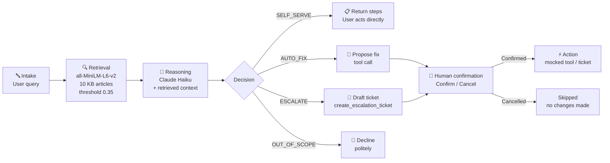

# TriagePilot — L1 IT Support Agent

First-line IT support has a predictable bottleneck: a user submits a ticket, it sits in a queue until a technician notices it, the technician identifies the pattern, looks up the procedure, and acts. The fix is rarely novel — but the dispatch delay is real. Industry benchmarks put L1 mean time to resolution (MTTR) at 4–8 hours for password resets and connectivity issues that take under two minutes to actually fix.

TriagePilot compresses that gap. It embeds Limmatica AG's internal KB articles, retrieves the most relevant one for each issue, and classifies the ticket into one of four resolution paths — with a human in the loop at the only moment that matters. The plausible target: MTTR from hours to under 60 seconds for well-documented issue classes.

---

## Architecture



| Path | When | Operator action required? |
|---|---|---|
| **SELF_SERVE** | Fix is documented, safe, and user-executable | No — steps returned directly |
| **AUTO_FIX** | Fix is documented, reversible, better run by the agent | Yes — Confirm or Cancel before tool runs |
| **ESCALATE** | Info missing, infra-side issue, or low confidence | Yes — Confirm or Cancel before ticket is created |
| **OUT_OF_SCOPE** | Not an IT support request | No — declined immediately |

---

## Why a knowledge base matters

Without retrieval, the model can only give generic advice — it has no way to know Limmatica's internal portal addresses, script paths, AD group names, or policy codes. The KB articles contain details that no pre-trained model could know:

- `vpn-gp.limmatica.corp` — the GlobalProtect gateway address post-migration
- `\\IT-TOOLS\Scripts\reset-vpn-profile.ps1` — the exact remediation script
- `Finance-RW` — the AD group that governs shared-drive access for Finance users
- `SEC-04` — the internal policy requiring escalation after 2+ lockouts in 24 h
- Q1 2026 AnyConnect → GlobalProtect migration context

**RAG on/off toggle in the demo**: pick any IT query, note the org-specific steps and retrieved document, then toggle RAG off and re-run — the model falls back to generic advice with no Limmatica context. The contrast is immediate.

---

## Where this could run

| Integration point | How | ServiceNow field mapping |
|---|---|---|
| ServiceNow intake | REST API POST to `/api/now/table/incident` | `app.queue` → `assignment_group` |
| Ticket ID | Auto-generated `INC{random}` (simulated) | `app.ticket_id` → `number` |
| Caller | `current.user` resolved via Okta | `app.requested_by` → `caller_id` |
| Priority | `P3-Normal` / `P2-High` / `P1-Critical` | `app.priority` → `priority` (3/2/1) |
| Short description | One-sentence diagnostic from LLM | `app.summary` → `short_description` |
| Category | IT Support / Endpoint | hardcoded → `category` |

The tool schema (`create_escalation_ticket`) is already structured to map 1-to-1 onto a ServiceNow incident record. Wiring it to a real instance is a configuration change, not a redesign.

---

## Demo queries

| Query | Expected path | What it demonstrates |
|---|---|---|
| "My VPN keeps disconnecting" | AUTO_FIX → `reset_vpn_profile` | RAG on: cites the AnyConnect→GlobalProtect migration, SCEP cert, exact script path. RAG off: generic "try reinstalling." |
| "Teams shows me as offline to everyone" | AUTO_FIX → `clear_teams_cache` | With RAG, checks build version first (26189 regression context). Retrieved doc determines triage order. |
| "I'm locked out of my account" | ESCALATE → `SEC-INCIDENT` | Lockout frequency not in query; per SEC-04 that distinction (routine vs. compromise) changes the path. Demonstrates missing-info → escalate rule. |
| "My OneDrive has been stuck syncing for two days" | ESCALATE → `M365-SYNC` | Ambiguous without knowing department or filenames — agent escalates with explicit reasoning. |
| "My external monitor isn't detected when docked" | ESCALATE → hardware team | Hardware-side with no software fix; agent correctly refuses AUTO_FIX. |
| "What's the weather like today?" | OUT_OF_SCOPE | Gray badge, no retrieval, no tool call. Scope-check fires before any diagnosis. |

---

<details>
<summary><strong>RAG design decisions</strong></summary>

- **One file per KB article** — each file is the retrieval unit. No chunking overhead, no boundary ambiguity. Semantically coherent units. Revisit chunking at hundreds of articles.
- **Threshold 0.35** — without it, retrieval always returns something, even for queries with no KB match, and the model may hallucinate grounding. The threshold makes the "no confident match" case explicit.
- **Sentence-level highlights** — same `all-MiniLM-L6-v2` model scores individual sentences against the query. Shows the reviewer exactly which lines triggered the retrieval decision. No additional dependencies.
- **Single-shot classification** — multi-turn dialogue adds latency, requires session state, and obscures the classification logic. Single-turn forces the agent to be explicit about missing information, which produces better escalation summaries than open-ended exchanges.
- **Human-in-the-loop on both AUTO_FIX and ESCALATE** — AUTO_FIX is obvious (don't silently unlock accounts). ESCALATE also gets a gate because opening a ticket routes to an on-call queue, starts an SLA clock, and notifies a technician. Both are consequential.

</details>

<details>
<summary><strong>Extending with MCP</strong></summary>

The tools here are called via Anthropic's native tool-use API (`tools=` in `messages.create`). MCP (Model Context Protocol) is the natural next step:

- **Service discovery** — agent discovers available tools (AD, Intune, ServiceNow connectors) at runtime via the MCP server manifest, without hardcoding schemas in the agent.
- **Credential isolation** — each connector runs in its own MCP server with scoped service-account credentials, keeping secrets out of the agent process.
- **Reuse across agents** — the same MCP connector for ServiceNow can be shared by this triage agent, a change-management agent, and an on-call bot without duplicating integration code.
- **Live KB sync** — an MCP resource server can expose the KB article directory, letting the agent pull the latest doc content at query time rather than from a static embedded index.

</details>

<details>
<summary><strong>Evaluation metrics for production RAG</strong></summary>

- **MTTR per path** — the primary business metric. Baseline against queue-mediated L1 (4–8 h target). Track separately for SELF_SERVE, AUTO_FIX, and ESCALATE so regressions are path-specific.
- **Retrieval precision@1** — fraction of queries where the top-ranked KB article is the correct one. Baseline requires a labelled query→article mapping.
- **Path accuracy** — fraction of queries classified into the correct path (SELF_SERVE / AUTO_FIX / ESCALATE / OUT_OF_SCOPE). Requires a held-out test set with ground-truth labels.
- **Escalation precision** — fraction of escalated tickets that the receiving technician confirms were correctly escalated (not a false-positive that AUTO_FIX could have handled).
- **Tool parameter validity** — fraction of AUTO_FIX tool calls that contain only concrete parameter values (no `current.user` placeholders reaching production where actual resolution is required).
- **False AUTO_FIX rate** — fraction of AUTO_FIX executions that either fail or require a follow-up ticket. Measures how often the agent over-confidently chose to act.

</details>

---

## Setup

```bash
python -m venv .venv && source .venv/bin/activate
pip install -r requirements.txt
echo "ANTHROPIC_API_KEY=sk-ant-..." > .env
streamlit run app.py
```

First run downloads `all-MiniLM-L6-v2` (~90 MB) and builds document embeddings. Both are cached in memory for the session.
