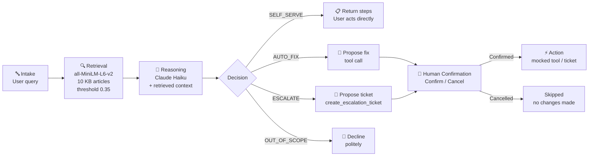

# TriagePilot — L1 IT Support Agent

Most first-line IT support tickets resolve the same way: match the user's description to a known procedure, hand back a checklist, run a script, or route to the right team. The bottleneck is not the fix — it's the dispatch delay between a user submitting a ticket and a technician recognising the pattern. TriagePilot automates that pattern-matching step using retrieval-augmented generation: it embeds the organisation's internal KB articles, retrieves the most relevant one for each incoming issue, and uses a language model to classify the issue into one of four outcomes — with a human confirmation gate before any action is taken. The result is a demonstrable pipeline that compresses L1 triage from minutes to seconds while keeping a human in the loop at the only moment that matters.

---

## Architecture



| Path | When | Operator action required? |
|---|---|---|
| **SELF_SERVE** | Fix is documented, safe, and user-executable | No — steps returned directly |
| **AUTO_FIX** | Fix is documented, reversible, better run by agent | Yes — Confirm or Cancel before tool runs |
| **ESCALATE** | Info missing, infra-side, or low confidence | Yes — Confirm or Cancel before ticket is created |
| **OUT_OF_SCOPE** | Not an IT support request | No — declined immediately |

---

## Traditional L1 vs. TriagePilot

| Step | Traditional L1 | TriagePilot |
|---|---|---|
| First response time | Minutes to hours (queue) | Seconds (embedding + LLM call) |
| Knowledge source | Technician memory / shared wiki | Embedded KB, org-specific procedures |
| Action execution | Ad-hoc, undocumented | Structured tool calls, logged with timestamp |
| Human oversight | Every ticket, every step | Required only at the action confirmation step |
| Out-of-scope detection | Human judgment | Automated — before any triage begins |
| When info is missing | Technician asks follow-up | Escalates with explicit reasoning, no back-and-forth |
| Audit trail | Free-text ticket comments | Tool call + confirmation + timestamp |

---

## Demo queries

Each preset demonstrates a specific capability:

| Query | Expected path | What it demonstrates |
|---|---|---|
| "My VPN keeps disconnecting" | AUTO_FIX → `reset_vpn_profile` | RAG on: cites the AnyConnect→GlobalProtect migration, SCEP cert, exact script path. RAG off: generic "try reinstalling" — no Limmatica-specific procedure. |
| "Teams shows me as offline to everyone" | AUTO_FIX → `clear_teams_cache` | With RAG: checks build version first (26189 regression context). The retrieved doc determines the triage order. |
| "I'm locked out of my account" | ESCALATE → `SEC-INCIDENT` or `DESKTOP-SUPPORT` | The agent escalates because lockout frequency isn't in the query, and per SEC-04 that distinction (routine vs. compromise) changes the entire path. Demonstrates the missing-info → escalate rule. |
| "My OneDrive has been stuck syncing for two days" | ESCALATE → `M365-SYNC` | Ambiguous without knowing the user's department or filenames — agent escalates with reasoning rather than asking. |
| "My external monitor isn't detected when docked" | ESCALATE → hardware team | Hardware-side issue with no software fix; agent correctly refuses AUTO_FIX. |
| "What's the weather like today?" | OUT_OF_SCOPE | Gray badge, no retrieval, no tool call. The scope-check fires before any diagnosis. |

**To demonstrate the RAG on/off contrast**: pick any IT query, note the retrieved document and org-specific steps, then toggle RAG off and re-run — the model falls back to generic advice with no Limmatica-specific context.

---

<details>
<summary><strong>Design decisions</strong></summary>

**Why RAG over plain prompting?**
The KB articles contain details no pre-trained model could know: internal portal addresses (`vpn-gp.limmatica.corp`), specific script paths (`\\IT-TOOLS\Scripts\reset-vpn-profile.ps1`), AD group names (`Finance-RW`), policy codes (`SEC-04`), and historical incident patterns (the Q1 2026 AnyConnect migration). Without retrieval, the model can only give generic advice. The RAG on/off toggle makes this contrast visible in seconds during a demo.

**Why human-in-the-loop on both AUTO_FIX and ESCALATE?**
AUTO_FIX is obvious: you shouldn't silently unlock accounts or restart production services. But ESCALATE also gets a confirmation gate — because opening a ticket routes to an on-call queue, starts an SLA clock, and notifies a technician. Both are consequential actions. The confirmation step is architecturally correct, not a safety hedge.

**Why function calling (tool use) and not MCP?**
The tools here are called via Anthropic's native tool-use API (`tools=` parameter in the `messages.create` call). MCP (Model Context Protocol) is the natural next step — it would let the agent discover and call external services (AD, Intune, ServiceNow) through a standardised interface without the tool definitions being hardcoded in the agent. The current implementation is intentionally self-contained so it can run without any external infrastructure.

**Why single-shot classification?**
Multi-turn dialogue would let the agent ask clarifying questions, but it also adds latency, requires session state management, and obscures the classification logic. The single-turn constraint forces the agent to be explicit about what information is missing and why — which produces better diagnostic summaries for the escalation ticket than an open-ended exchange would.

**Why one file per KB article?**
Each file is the retrieval unit. Chunking a single large document requires overlap tuning and introduces boundary ambiguity. One article per file gives clean, semantically coherent units with zero chunking overhead. At this corpus size it's unambiguously correct; revisit chunking when the corpus reaches hundreds of articles.

**Why a similarity threshold (0.35)?**
Without a threshold, retrieval always returns something — even for queries with no KB match — and the agent may hallucinate grounding from a weakly related article. The threshold makes the "no confident match" case explicit and keeps the RAG on/off comparison honest.

</details>

<details>
<summary><strong>Known limitations</strong></summary>

- **Synthetic knowledge base.** All 10 KB articles were written for this demo. Real deployment needs actual company documentation, which varies widely in quality and coverage.
- **Mocked tool execution.** No real actions are taken. Production integration requires service accounts with least-privilege access to AD, Intune, PaperCut, and ServiceNow.
- **Small corpus (10 articles).** Embedding quality and threshold calibration need revalidation at scale. Top-k retrieval and optional re-ranking become necessary with hundreds of articles.
- **Single-turn only.** The agent doesn't maintain conversation history. Some real L1 issues genuinely require back-and-forth — the current architecture can't handle those.
- **No evaluation set.** The threshold (0.35) and model choice are set by inspection, not measured precision/recall against a labelled query set.
- **Usernames as free text.** Tools accept usernames as unvalidated strings. A real deployment would resolve these against AD or Okta before calling any tool.

</details>

---

## Setup

```bash
python -m venv .venv && source .venv/bin/activate
pip install -r requirements.txt
echo "ANTHROPIC_API_KEY=sk-ant-..." > .env
streamlit run app.py
```

First run downloads `all-MiniLM-L6-v2` (~90 MB) and builds document embeddings. Both are cached in memory for the session.
